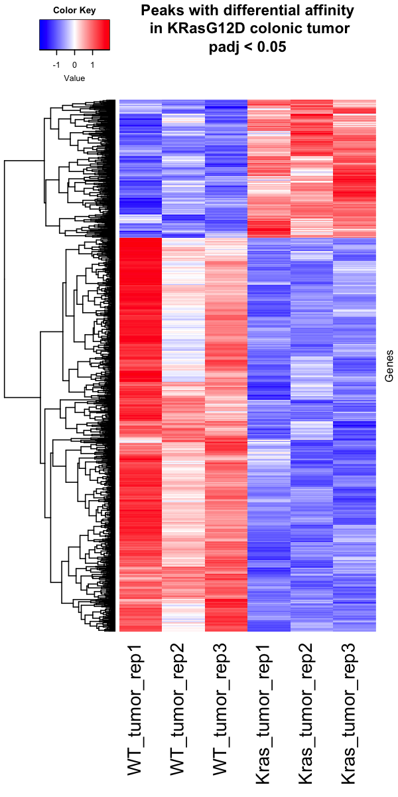

```{r setup, include=FALSE}
knitr::opts_chunk$set(echo = TRUE)
```

# Library loading and set up
```{r message=FALSE, warning=FALSE}
library(tidyverse)
library(DESeq2)
library(knitr)
library(kableExtra)
library(plyranges)
library(stringr)
library(biobroom)
library(ggrepel)
library(RColorBrewer)
library(gplots)
library(biomaRt)
library(ChIPseeker)
library(TxDb.Mmusculus.UCSC.mm10.knownGene)
library(mixOmics)
library(mosaic)
library(clusterProfiler)
library(DOSE)
library(org.Mm.eg.db)
library(pathview)
library(AnnotationDbi)
library(fgsea)
library(rvest)
library(ggseqlogo)
library(gridExtra)
library(rtracklayer)
library(Biostrings)
library(Rsamtools)
library(data.table)
library(grid)
library(enrichplot)
```

# Load dataset
This dataset is generated using WT and KRas-G12D expressingn colonic tumor from mouse. Tumors were induced via 4-OHT enema. Mice used are
 - Villin-CreER/+; Apc(fl/fl)
 - Villin-CreER/+; Apc(fl/fl); KRasG12D/+

Alignment and peak calling was done using the `bcbio` ATAC-Seq pipeline following instructions described here: (https://bcbio-nextgen.readthedocs.io/en/latest/contents/atac.html)

Merged peak data are used here. This is obtained by combining all peaks from all samples, merging peaks within 500bp of each other, and using `featureCount` to count all reads in the peaks.

```{r message=FALSE, warning=FALSE}
dir.create("PDF_Figure", showWarnings = FALSE)

metadata = readr::read_csv("Data/bcbio_output/metadata.csv") %>%
  dplyr::rename("sample"=...1) %>%
  dplyr::select(-batch, -phenotype) %>%
  dplyr::filter(tissue == "colon_tumor") %>%
  mutate(condition=relevel(factor(condition), ref="WT")) %>%
  as.data.frame()
rownames(metadata) = metadata$sample
counts = readr::read_tsv("Data/bcbio_output/merged/merged-counts.tsv") %>%
  tibble::column_to_rownames("id")

```

Metadata
```{r metadata-table}
metadata %>%
  kable() %>%
  kable_styling()
```

Load Ensembl ID dataset
```{r eval = F}
ensembl = useMart("ensembl", dataset="mmusculus_gene_ensembl")
symbols = getBM(attributes=c("entrezgene_id", "mgi_symbol", "ensembl_gene_id"), mart=ensembl) %>%
  dplyr::rename("geneId"=entrezgene_id) %>%
  mutate(geneId=as.character(geneId))

save(symbols, file = "Data/symbols.rda")
```


# Cleanup
We need to do a little it of cleanup before contining. We need to remove peaks
that appear in regions known to be false positive machines, called the blacklist
regions. We also are interested in regions that could be affecting expression
via chromatin accessability, so we'll only consider peaks within a window around
the transcription start sites of genes. 

## Blacklist region removal

```{r remove-blacklist, message=FALSE, warning=FALSE}
load("Data/symbols.rda")

expand_region_string = function(df, column) {
  df = as.data.frame(df)
  tokens = str_split_fixed(df[,column], ":", 2)
  chrom = tokens[,1]
  start = as.numeric(str_split_fixed(tokens[,2], "-", 2)[, 1])
  end = as.numeric(str_split_fixed(tokens[,2], "-", 2)[, 2])
  regions = data.frame(seqnames=chrom, start=start, end=end)
  df %>%
    bind_cols(regions)
}
blacklist = readr::read_tsv("Data/mm10-blacklist.v2.bed.gz", col_names=c("seqnames", "start", "end")) %>%
  as_granges()
blacklist_peaks = counts %>%
  tibble::rownames_to_column("peak") %>%
  expand_region_string("peak") %>%
  as_granges() %>%
  join_overlap_inner(blacklist) %>%
  tidy() %>%
  pull(peak)
counts = counts[!rownames(counts) %in% blacklist_peaks, ]
```

A few peaks overlap the ENCODE blacklist regions, so we removed them from the analysis. There 
were `r length(blacklist_peaks)` that overlapped with the blacklist regions.

## Open region annotation
Here we annotate the peaks that we called with contextual genomic information. We can also see that
some peaks are annotated in multiple regions, this can't be helped as genes overlap so there
are areas where multiple features of genes overlap.

```{r}
annotatedobj = ChIPseeker::annotatePeak(counts %>%
                                        tibble::rownames_to_column("peak") %>%
                                        expand_region_string("peak") %>%
                                        as_granges(), TxDb = TxDb.Mmusculus.UCSC.mm10.knownGene)
plotAnnoPie(annotatedobj)

pdf('PDF_Figure/Annotation_Pie.pdf',
    width = 6,
    height = 4)
plotAnnoPie(annotatedobj)
dev.off()

upsetplot(annotatedobj)

pdf('PDF_Figure/UpsetPlot.pdf',
    width = 6,
    height = 4)
upsetplot(annotatedobj)
dev.off()
```


## Remove peaks not near TSS
Generally we only care about peaks that are close to gene, here we are pretty lenient and consider
peaks that are within 1000 bases of a transcription start site of a gene.

```{r tss-peaks}
annotated = annotatedobj %>%
  as.GRanges() %>%
  tidy() 
ggplot(annotated, aes(distanceToTSS)) +
  stat_density(geom="line") +
  xlim(c(-10000,10000)) 
```

```{r keep-tss-peaks}
KEEP_DISTANCE = 1000
close_to_tss = annotated %>%
  dplyr::filter(abs(distanceToTSS) < KEEP_DISTANCE) %>%
  pull(peak)
counts = counts[rownames(counts) %in% close_to_tss,]
```
Most peaks fall close to the TSS, but there are some that are very far away from the TSS. We'll 
remove peaks that aren't anywhere near the TSS for a gene from the analysis. We'll keep only
peaks within `r KEEP_DISTANCE` bases of a TSS. This leaves us with `r length(close_to_tss)` peaks to consider.

## Post filtering peak annotation
Here we annotate the peaks post-filtering

```{r}
annotatedobj = ChIPseeker::annotatePeak(counts %>%
                                        tibble::rownames_to_column("peak") %>%
                                        expand_region_string("peak") %>%
                                        as_granges(), TxDb = TxDb.Mmusculus.UCSC.mm10.knownGene)
plotAnnoPie(annotatedobj)

pdf('PDF_Figure/Annotation_Pie_filtered.pdf',
    width = 6,
    height = 4)
plotAnnoPie(annotatedobj)
dev.off()

upsetplot(annotatedobj)

pdf('PDF_Figure/UpsetPlot_filtered.pdf',
    width = 6,
    height = 4)
upsetplot(annotatedobj)
dev.off()
```

# Differential affinity analysis
Here we look at the **condition_Kras_vs_WT** coefficient, which will show us the peak 
affinity differences between the mouse KRasG12D and WT pancreatic epithelial cell samples.
```{r}
dds = DESeqDataSetFromMatrix(counts, metadata, design=~condition)
dds = DESeq(dds)
# Print scale factors for BW normalization
1/sizeFactors(dds)
plotDispEsts(dds)
CUTOFF = 0.05
dds_result <- lfcShrink(dds, coef = "condition_Kras_vs_WT", type = "normal")
```

## QC
```{r}
DESeq2::plotMA(dds_result)

dds_transform <- varianceStabilizingTransformation(dds)
rawCountTable_transform <- as.data.frame(assay(dds_transform))
pseudoCount_transform = log2(rawCountTable_transform + 1)
mat.dist = pseudoCount_transform
mat.dist = as.matrix(dist(t(mat.dist)))
mat.dist = mat.dist/max(mat.dist)
png('Figure/Hierchical_Clustering_merged.png')
cim(mat.dist, symkey = FALSE, margins = c(7,7))
suppressMessages(dev.off())

include_graphics('Figure/Hierchical_Clustering_merged.png')

pdf('PDF_Figure/Hierchical_Clustering.pdf',
    width = 6,
    height = 6)
cim(mat.dist, symkey = FALSE, margins = c(7,7))
dev.off()
```

The top 500 most variable genes are selected for PCA analysis.
```{r}
plotPCA(dds_transform, intgroup = "condition", ntop = 500)

pdf('PDF_Figure/PCA.pdf',
    width = 6,
    height = 4)
plotPCA(dds_transform, intgroup = "condition", ntop = 500)
dev.off()
```

## Output results
Signal to noise ratio is calculated using the definition given by Broad [GSEA](https://www.gsea-msigdb.org/gsea/doc/GSEAUserGuideFrame.html?Run_GSEA_Page).
```{r forebrain-hindbrain}
markup_deseq2 = function(res) {
  resanno = res %>%
    expand_region_string("peak") %>%
    as_granges()
  ChIPseeker::annotatePeak(resanno, TxDb=TxDb.Mmusculus.UCSC.mm10.knownGene) %>%
    as.GRanges() %>%
    tidy() %>%
    left_join(symbols, by="geneId")
}

res = dds_result %>%
  as_tibble(rownames = "peak")

# calculate signal-to-noise ratio for GSEA later
s2n <- function(num_list, cond_1 = c(4:6), cond_2 = c(1:3)) {
  mean1 <- mean(num_list[cond_1])
  if (mean1 == 0) {
    mean1 = 1
  }
  mean2 <- mean(num_list[cond_2])
  if (mean2 == 0) {
    mean2 = 1
  }
  sd1 <- sd(num_list[cond_1])
  sd2 <- sd(num_list[cond_2])
  sd1 <- min(sd1, 0.2*abs(mean1))
  sd2 <- min(sd2, 0.2*abs(mean2))
  s2nvalue <- (mean1-mean2)/(sd1+sd2)
  return(s2nvalue)
}

rawCountTable <- as.data.frame(DESeq2::counts(dds, normalize = TRUE)) 

res$s2n <- apply(rawCountTable,1,s2n)

res <- markup_deseq2(res)

res <- res[!duplicated(res$peak),]

write.csv(res, "Result/ATAC_crc_Kras-WT_merged.csv", row.names = FALSE)

rawCountTable <- rawCountTable %>% rownames_to_column(var = "peak")
rawCountTable <- left_join(rawCountTable, res[,c(6,24)], by = c("peak" ="peak")) 

write.csv(rawCountTable, "Result/ATAC_crc_normalized_count.csv", row.names = FALSE, na = "")
```
### Description of output files

- **start**: start of peak
- **end**: end of peak
- **width**: width of peak
- **strand**: strand of peak
- **seqname**: chromosome of peak
- **peak**: ID of peak
- **baseMean**: mean count of reads at peak for all samples
- **estimate**: log2 fold change of comparison
- **stderror**: standard error of the log2 fold change
- **statistic**: value of test statistic (Wald test)
- **p.value**: unadjusted p-value
- **p.adjusted**: adjusted p-value by BH correction
- **annotation**: proximity to nearest gene feature
- **geneChr**: chromosome of gene
- **geneStart**: start coordinate of gene
- **geneEnd**: end coordinate of gene
- **geneId**: Entrez gene ID of gene
- **transcriptId**: transcript ID
- **distanceToTSS**: distance to nearest transcription start site
- **mgi_symbol**: gene symbol from MGI

## Visualization
### Heatmap
```{r forebrain-hindbrain-plots-heatmap, fig.height=7, fig.width=4}
res_sig = res %>%
  dplyr::filter(padj < CUTOFF) %>%
  #arrange(pvalue) %>%
  #head(200) %>%
  pull(peak)
ncounts = DESeq2::counts(dds, normalized=TRUE)
pseudoCount = log2(ncounts + 1)

res_sig_counts = ncounts[rownames(ncounts) %in% res_sig,] %>% apply(1,zscore) %>% t()

my_palette <- colorRampPalette(c("blue", "white", "red"))(256)

png('Figure/KRas vs WT crc ATAC-Seq_merged.png',
    width = 600,
    height = 1200,
    res = 150,
    pointsize = 8)
par(cex.main=1.1)
heatmap.2(res_sig_counts,
          main = "Peaks with differential affinity\n in KRasG12D colonic tumor\npadj < 0.05",
          density.info = "none",
          key = TRUE,
          lwid = c(3,7),
          lhei = c(1,7),
          col=my_palette,
          margins = c(15,2),
          symbreaks = TRUE,
          trace = "none",
          dendrogram = "row",
          labRow = FALSE,
          ylab = "Genes",
          cexCol = 2,
          Colv = "NA")
dev.off()



pdf('PDF_Figure/Heatmap.pdf',
    width = 6,
    height = 12)
par(cex.main=1.1)
heatmap.2(res_sig_counts,
          main = "Peaks with differential affinity\n in KRasG12D colonic tumor\npadj < 0.05",
          density.info = "none",
          key = TRUE,
          lwid = c(3,7),
          lhei = c(1,7),
          col=my_palette,
          margins = c(15,2),
          symbreaks = TRUE,
          trace = "none",
          dendrogram = "row",
          labRow = FALSE,
          ylab = "Genes",
          cexCol = 2,
          Colv = "NA")
dev.off()
```

### Scatter Plot
```{r}
# Scatter plot
res$kras_mean <- rowMeans(pseudoCount[,4:6])
res$wt_mean <- rowMeans(pseudoCount[,1:3])
ggplot(res, aes(x = wt_mean, y = kras_mean)) +
  xlab("WT_Average(log2)") + ylab("KRas_Average(log2)") + 
  geom_point(data = res, alpha = 0.5, size = 1, color = "grey") +
  geom_point(data = subset(res, padj < 0.05 & log2FoldChange > 0), alpha = 0.5, size = 1, color = "red") +
  geom_point(data = subset(res, padj < 0.05 & log2FoldChange < 0), alpha = 0.5, size = 1, color = "blue") +
  labs(title = "KRasG12D vs WT ATAC-Seq Scatter Plot")

pdf('PDF_Figure/Scatter_Plot.pdf',
    width = 5,
    height = 4)
ggplot(res, aes(x = wt_mean, y = kras_mean)) +
  xlab("WT_Average(log2)") + ylab("KRas_Average(log2)") + 
  geom_point(data = res, alpha = 0.5, size = 1, color = "grey") +
  geom_point(data = subset(res, padj < 0.05 & log2FoldChange > 0), alpha = 0.5, size = 1, color = "red") +
  geom_point(data = subset(res, padj < 0.05 & log2FoldChange < 0), alpha = 0.5, size = 1, color = "blue") +
  labs(title = "KRasG12D vs WT ATAC-Seq Scatter Plot")
dev.off()
```

### MA Plot
```{r}
# MA plot
ggplot(res, aes(x = log(baseMean,2), y = log2FoldChange,)) +
  xlab("Average Expression") + ylab("LFC") + 
  geom_point(data = res, alpha = 0.5, size = 1, color = "grey") +
  geom_point(data = subset(res, padj < 0.05 & log2FoldChange > 0), alpha = 0.5, size = 1, color = "red") +
  geom_point(data = subset(res, padj < 0.05 & log2FoldChange < 0), alpha = 0.5, size = 1, color = "blue") +
labs(title = "KRas vs WT pancreas ATAC-Seq MA Plot")

pdf('PDF_Figure/MA_Plot.pdf',
    width = 5,
    height = 4)
ggplot(res, aes(x = log(baseMean,2), y = log2FoldChange,)) +
  xlab("Average Expression") + ylab("LFC") + 
  geom_point(data = res, alpha = 0.5, size = 1, color = "grey") +
  geom_point(data = subset(res, padj < 0.05 & log2FoldChange > 0), alpha = 0.5, size = 1, color = "red") +
  geom_point(data = subset(res, padj < 0.05 & log2FoldChange < 0), alpha = 0.5, size = 1, color = "blue") +
labs(title = "KRas vs WT pancreas ATAC-Seq MA Plot")
dev.off()
```

### Volcano Plot
```{r}
# Volcano Plot
ggplot(res, aes(x = log2FoldChange, y = -log(padj,10))) +
  xlab("LFC") + ylab("-log10(P value)") + 
  geom_point(data = res, alpha = 0.5, size = 1, color = "black") +
  geom_point(data = subset(res, padj < 0.05 & log2FoldChange > 0), alpha = 0.5, size = 1, color = "red") +
  geom_point(data = subset(res, padj < 0.05 & log2FoldChange < 0), alpha = 0.5, size = 1, color = "blue") +
labs(title = "KRas vs WT pancreas ATAC-Seq Volcano Plot")

pdf('PDF_Figure/Volcano_Plot.pdf',
    width = 5,
    height = 4)
ggplot(res, aes(x = log2FoldChange, y = -log(padj,10))) +
  xlab("LFC") + ylab("-log10(P value)") + 
  geom_point(data = res, alpha = 0.5, size = 1, color = "black") +
  geom_point(data = subset(res, padj < 0.05 & log2FoldChange > 0), alpha = 0.5, size = 1, color = "red") +
  geom_point(data = subset(res, padj < 0.05 & log2FoldChange < 0), alpha = 0.5, size = 1, color = "blue") +
labs(title = "KRas vs WT pancreas ATAC-Seq Volcano Plot")
dev.off()
```

# Pathway Enrichment
## GO
Classic GO analysis is performed here for all DE peak-genes detected in this dataset. The reference list is list of peak-genes detected in ATAC-Seq. Three categories of GO terms are tested here, including biological process, molecular function and cellular component.
```{r}
dir.create("Result/GO", showWarnings = FALSE)

target_gene <- res %>% dplyr::filter(padj < 0.05) %>% dplyr::select(ensembl_gene_id) %>% unlist() %>% as.character()
detected_gene <- res %>% dplyr::select(ensembl_gene_id) %>% unlist() %>% as.character()

# Run GO enrichment analysis for biological process
ego_BP <- enrichGO(gene = target_gene, 
                universe = detected_gene,
                keyType = "ENSEMBL",
                OrgDb = org.Mm.eg.db, 
                ont = "BP", 
                pAdjustMethod = "BH", 
                pvalueCutoff = 0.05, 
                readable = TRUE)

# Output results from GO analysis to a table
cluster_summary_BP <- data.frame(ego_BP)

write.csv(cluster_summary_BP, "Result/GO/GO analysis_BP_merged.csv")

# Run GO enrichment analysis for molecular function 
ego_MF <- enrichGO(gene = target_gene, 
                universe = detected_gene,
                keyType = "ENSEMBL",
                OrgDb = org.Mm.eg.db, 
                ont = "MF", 
                pAdjustMethod = "BH", 
                pvalueCutoff = 0.05, 
                readable = TRUE)

# Output results from GO analysis to a table
cluster_summary_MF <- data.frame(ego_MF)

write.csv(cluster_summary_MF, "Result/GO/GO analysis_MF_merged.csv")

# Run GO enrichment analysis for cellular component 
ego_CC <- enrichGO(gene = target_gene, 
                universe = detected_gene,
                keyType = "ENSEMBL",
                OrgDb = org.Mm.eg.db, 
                ont = "CC", 
                pAdjustMethod = "BH", 
                pvalueCutoff = 0.05, 
                readable = TRUE)

# Output results from GO analysis to a table
cluster_summary_CC <- data.frame(ego_CC)

write.csv(cluster_summary_CC, "Result/GO/GO analysis_CC_merged.csv")
```

### Biological Process
```{r}
pdf("PDF_Figure/GO_BP_Dotplot.pdf",
    width = 10,
    height = 10)
dotplot(ego_BP, showCategory=20)
dev.off()

include_graphics('PDF_Figure/GO_BP_Dotplot.pdf')

ego_BP <- pairwise_termsim(ego_BP)
pdf("PDF_Figure/GO_BP_eMAPplot.pdf",
    width = 10,
    height = 10)
emapplot(ego_BP, showCategory = 50)
dev.off()

include_graphics('PDF_Figure/GO_BP_eMAPplot.pdf')

OE_foldchanges <- res %>% dplyr::filter(padj < 0.05) %>% dplyr::select(c(log2FoldChange, mgi_symbol))
OE <- OE_foldchanges$log2FoldChange %>% unlist()
names(OE) <- OE_foldchanges$mgi_symbol

pdf("PDF_Figure/GO_BP_cNetplot.pdf",
    width = 10,
    height = 10)
cnetplot(ego_BP, 
         categorySize="pvalue", 
         showCategory = 5, 
         foldChange=OE, 
         vertex.label.font=6)
dev.off()

include_graphics('PDF_Figure/GO_BP_cNetplot.pdf')
```

### Molecular Function
```{r}
pdf("PDF_Figure/GO_MF_Dotplot.pdf",
    width = 10,
    height = 5)
dotplot(ego_MF, showCategory=10)
dev.off()

include_graphics('PDF_Figure/GO_MF_Dotplot.pdf')

ego_MF <- pairwise_termsim(ego_MF)
pdf("PDF_Figure/GO_MF_eMAPplot.pdf",
    width = 10,
    height = 10)
emapplot(ego_MF, showCategory = 50)
dev.off()

include_graphics('PDF_Figure/GO_MF_eMAPplot.pdf')


pdf("PDF_Figure/GO_MF_cNetplot.pdf",
    width = 10,
    height = 10)
cnetplot(ego_MF, 
         categorySize="pvalue", 
         showCategory = 5, 
         foldChange=OE, 
         vertex.label.font=6)
dev.off()

include_graphics('PDF_Figure/GO_MF_cNetplot.pdf')
```

### Cellular Component
```{r}
pdf("PDF_Figure/GO_CC_Dotplot.pdf",
    width = 10,
    height = 5)
dotplot(ego_CC, showCategory=10)
dev.off()

include_graphics('PDF_Figure/GO_CC_Dotplot.pdf')

ego_CC <- pairwise_termsim(ego_CC)
pdf("PDF_Figure/GO_CC_eMAPplot.pdf",
    width = 10,
    height = 10)
emapplot(ego_CC, showCategory = 50)
dev.off()

include_graphics('PDF_Figure/GO_CC_eMAPplot.pdf')


pdf("PDF_Figure/GO_CC_cNetplot.pdf",
    width = 10,
    height = 10)
cnetplot(ego_CC, 
         categorySize="pvalue", 
         showCategory = 5, 
         foldChange=OE, 
         vertex.label.font=6)
dev.off()

include_graphics('PDF_Figure/GO_CC_cNetplot.pdf')
```

## KEGG
```{r}
target_gene <- res %>% dplyr::filter(padj < 0.05) %>% dplyr::select(geneId) %>% unlist() %>% as.character()
detected_gene <- res %>% dplyr::select(geneId) %>% unlist() %>% as.character()

kk <- enrichKEGG(gene = target_gene, 
                 universe = detected_gene,
                 organism = 'mmu',
                 keyType = "kegg",
                 pAdjustMethod = "BH", 
                 pvalueCutoff = 0.05)

kk.result <- as.data.frame(kk)

pdf("PDF_Figure/KEGG_Dotplot.pdf",
    width = 10,
    height = 5)
dotplot(kk, showCategory=10)
dev.off()

dir.create("Result/KEGG", showWarnings = FALSE)
write.csv(kk.result, "Result/KEGG/KEGG analysis_merged.csv")
```

# Motif Enrichment via HOMER
The `BED` files are prepared in R. HOMER was run in the terminal.
## Prepare function for HOMER result parsing
```{r}
plotHomerResults <- function(homer.table, homer.pwms, n.motifs = 20) {
    ncol <- 4
    laymat <- matrix(1:((1 + n.motifs) * ncol), ncol = ncol, byrow = FALSE)
    logos.list <- lapply(homer.pwms[1:n.motifs],
                         function(pwm) {
                             ggseqlogo(pwm) +
                                 theme(axis.text.x = element_blank(),
                                       axis.title.y = element_blank(),
                                       axis.line.y =
                                           element_line(color = "gray"),
                                       axis.ticks.y =
                                           element_line(color = "gray")) +
                                 ylim(0, 2)
                         })
    ranks.text <- sapply(homer.table$Rank[1:n.motifs], textGrob,
                         simplify = FALSE)
    pval.text <- sapply(sprintf("%.0f", -homer.table$log10.p)[1:n.motifs],
                        textGrob, simplify = FALSE)
    targ.text <- sapply(homer.table$freq.targets[1:n.motifs], textGrob,
                        simplify = FALSE)
    bg.text <- sapply(homer.table$freq.bg[1:n.motifs], textGrob,
                      simplify = FALSE)
    tf.text <- sapply(homer.table$best.match.simple[1:n.motifs], textGrob,
                      simplify = FALSE)
    headers <- sapply(c("rank", "motif", "-log10\np-value",
                        "freq.\ntargets", "freq.\nbackgr.",
                        "best match"),
                      textGrob,
                      simplify = FALSE)
    all.plots <- c(headers[1], ranks.text,
                   headers[2], logos.list,
                   headers[3], pval.text,
                   # headers[4], targ.text,
                   # headers[5], bg.text,
                   headers[6], tf.text)
    grid.arrange(grobs = all.plots, layout_matrix = laymat,
                 # widths = c(1, 4, 1, 1, 1, 3),
                 widths = c(1, 4, 1, 3),
                 ncol = ncol)
}

loadPWM <- function(filename) {
    motif <- fread(filename, skip = 1)
    if (nrow(motif) > 0) {
        pwm <- t(as.matrix(as.data.frame(motif)))
        rownames(pwm) <- c("A", "C", "G", "T")
        pwm
    } else {
        NULL
    }
}

loadHomerResults <- function(dirname) {
    # also allow version="extended" for motifs without stringent
    #   similarity filtering
    homer.table <-
        html_nodes(read_html(sprintf("%s/homerResults.html", dirname)), "table")
    homer.table <- html_table(homer.table, header = TRUE)[[1]]
    homer.table <- data.table(homer.table, check.names = TRUE)
    homer.table <- homer.table[, .(Rank,
                                   log10.p = log.P.pvalue / log(10),
                                   freq.targets = X..of.Targets,
                                   freq.bg = X..of.Background,
                                   best.match = Best.Match.Details)]
    homer.table[, filename := sprintf("%s/homerResults/motif%s.motif",
                                      dirname, seq_along(Rank))]
    homer.table[, best.match.simple := sapply(strsplit(homer.table$best.match, "/"), "[", 1)]
    homer.pwms <- sapply(homer.table$filename, loadPWM, simplify = FALSE)
    list(homer.table, homer.pwms)
}
```

## Up-regulated peaks in KRasG12D pancreas
Actual HOMER run was done on O2
```{r fig.height=8, fig.width=6}
res.up <- res %>% dplyr::filter(padj < CUTOFF & log2FoldChange > 0) %>% GRanges()
dir.create("Result/Kmer", showWarnings = FALSE)
rtracklayer::export(res.up, "Result/Kmer/KRas_up_ATAC_peaks_merged.bed")

genomic.regions <- "Result/Kmer/KRas_up_ATAC_peaks_merged.bed"
homerdir <- "Result/Kmer/homer-denovo-output-KRas_up_peaks"
dir.create(homerdir, showWarnings = FALSE)

homer.cmd <- sprintf("findMotifsGenome.pl %s mm10 %s -len 8 -size given -p 10 -bits -cache 1000 >.homer-output 2>.err.homer-output", genomic.regions, homerdir)

print(homer.cmd)

up.peaks.homer.res <- loadHomerResults(homerdir)
print(up.peaks.homer.res[[1]]$best.match.simple)

plotHomerResults(up.peaks.homer.res[[1]],
                 up.peaks.homer.res[[2]], n.motifs = 6)
```

## Down-regulated peaks in KRasG12D pancreas
Actual HOMER run was done on O2
```{r fig.height=8, fig.width=6}
res.down <- res %>% dplyr::filter(padj < CUTOFF & log2FoldChange < 0) %>% GRanges()
dir.create("Result/Kmer", showWarnings = FALSE)
rtracklayer::export(res.up, "Result/Kmer/KRas_down_ATAC_peaks_merged.bed")

genomic.regions <- "Result/Kmer/KRas_down_ATAC_peaks_merged.bed"
homerdir <- "Result/Kmer/homer-denovo-output-KRas_down_peaks"
dir.create(homerdir, showWarnings = FALSE)

homer.cmd <- sprintf("findMotifsGenome.pl %s mm10 %s -len 8 -size given -p 10 -bits -cache 1000 >.homer-output 2>.err.homer-output", genomic.regions, homerdir)

print(homer.cmd)

down.peaks.homer.res <- loadHomerResults(homerdir)
print(down.peaks.homer.res[[1]]$best.match.simple)

plotHomerResults(down.peaks.homer.res[[1]],
                 down.peaks.homer.res[[2]], n.motifs = 6)
```

# Session Info
```{r}
sessionInfo()
```